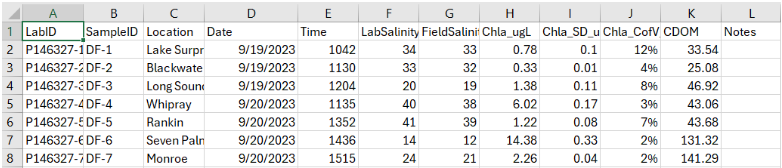

```{r setup, include=FALSE}
knitr::opts_chunk$set(echo = TRUE)
```

## Package Installation

To be updated when package on GitHub.

```{r, results="hide", warning=FALSE}
library(NewDataflowR)
```


## Handling Streaming Data

Incoming streaming data should be placed in your working directory under DF_FullDataSets/Raw/InstrumentOutput in a folder named for the survey date in yyyymm format (e.g. Feb-2015 is 201502). Likewise, data files (DF, C6, Eureka/Manta, Exo) in ".csv" format should by prepended with the survey date in yyyymmdd format. Also, data files should be appended with the two or three letter code corresponding to its respective instrument (see below). For example, the raw data files for February 2015 would be named as follows and placed in the following directory structure: (localpath) -> DF_FullDataSets -> Raw -> InstrumentOutput -> 201502 -> 20150211_DF.csv; 20150211_C6.csv; 20150211_eu.csv; 20150211_exo.csv 

You may need to modify the raw datafiles a bit in order for the streamclean function to read them. Make sure there is no °C symbol in the temperature columns in the exo or C6 files. If there is, just rename the column to “Temp”. If you get an error along the line of “invalid multibyte string” when running the streamclean function, it is likely because there is a strange character in the column names of one of the files. 

If you are missing a C6 file for one of the days, you will need to create a blank C6 file for that day that follows the same format as the other files but does not contain any streaming data.

You’ll also want to make sure the column names are consistent across the exo files, otherwise you may get an error along the lines of “names do not match previous names.” 

Cleaning is accomplished via the streamclean function. The example below shows how to specify inputs to clean the data for the March 2025 survey. First, assign the yearmon argument to 202503. Next, designate which instrument will be the primary source for gps measurements. In this case, we need to set gps to exo. Specify the expected number of measurements per minute for each instrument using the respective mmin argument. For this example we set the tofile parameter to FALSE but setting it to TRUE will save the cleaned output to DF_FullDataSets as a .csv file.  

```{r eval=F}
#Clean streaming data
dt <- streamclean(yearmon = 202503, gps = "exo", exommin = 12, c6mmin = 12, tofile = FALSE)
```

The streamclean function will gather all the records associated with the remaining streams, merge them with the gps target, remove leading and trailing records of all zeros, format GPS coordinates, check that conductivity to salinity calculations are correct (recalculate if necessary), and classify records based on fathom and CERP basin designations. Variable names and column ordering are formatted consistently and a machine readable (POSIX) date-time stamp is created. 

## QA of Streaming Data

For all data files going through the QA process, save separate copies of the original data and post-QA data. 

# Preparation:

1. Combine data from both instruments and all days (streamclean function in R) 
2. Create plots in excel of each parameter and/or use the DF_QA_test.R code to plot data and flag outliers. 
  * If using the DF_QA_test.R code, you may need to modify some areas to be able to accommodate your working directory, variable names, etc. 
3. Import .csv into GIS file and display locations 
  * Streaming data path shapefiles and streamcleaned datasets are available here: \ad.sfwmd.gov\dfsroot\GPro\ASB\ESA\FloridaBay\Dataflow\Streaming_Data_Paths 

# QA Procedure:

Work through the following steps while examining the data in Excel and/or R. If using the DF_QA_test.R code, it will check and flag outliers via the threshold distance from moving median and Z-score threshold methods. The flagged points will be marked red on the plots. 

1. Examine the range of values for each parameter. Are the values reasonable based on the type of probe? 
  * YES: keep values 
  * NO: remove, change (eg. change negative fluorescence values to 0) or continue assessing if not sure. 
2. Look for obvious outliers. Examining the values and path in ArcGIS, as well as the field notes may be helpful for figuring out where certain outliers occurred. 
  * Were there any events that occurred during sampling that may have skewed the data in this direction? (examining path may provide insight) 
    * NATURAL EVENTS (ie. cold front, proximity to creek mouth, etc.): keep values but make sure to note what occurred (if not noted already). 
    * HUMAN-CAUSED EVENTS (ie. boat getting stuck, sucking up mud, etc.): remove values. 
      * Any values that occurred when idling near the dock should be removed as well. 
  * Do the outlier values exhibit a continuous trend or an abrupt jump? 
    * CONTINUOUS: values are more likely to be valid. 
    * APRUPT: values are less likely to be valid. 
  * Do multiple parameters exhibit similar trends? 
    * YES: more likely to be valid. 
    * NO: less likely to be valid.
The answers to the last two questions may require a bit more thought when deciding whether the outlier values should be considered valid or removed. 
3. Re-evaluate remaining data after extreme outliers are removed.  
  * Are the values reasonable for this time of year? 
    * YES: likely valid. 
    * NO: consider what may have caused unusual values. If no plausible cause, may want to remove. 
  * Evaluate the same questions from 2. 
  * Be careful of overcleaning. If a value seems plausible given the circumstances, it is probably best to keep it. 
When satisfied with the QA of the data, save the new, cleaned csv file with _qa appended to the name (eg. 202409j_qa.csv) in a folder labeled “QA datasets” within the “DF_FullDataSets” folder. 

## Loading Previously Cleaned Streaming Data

The streamget function will retrieve previously cleaned data. Setting the qa parameter to TRUE (as is the default) will load the version of the streamcleaned data that has undergone QA. If you are using older data that was subjected to the old DataflowR streamqa function, you will need to make sure to put the QAd dataset in the "QA datasets" folder. If no QA has been done, or the dataset is not in the "QA datasets" folder, or the qa parameter is set to FALSE, streamget will load the original streamcleaned dataset.

```{r eval=F}
#Load streamcleaned data
dt <- streamget(yearmon=202503, qa=FALSE)
#Load streamcleaned data that has undergone QA
dt <- streamget(yearmon=202503, qa=TRUE)
```

## Interpolating Cleaned Data Files

The streaminterp function will interpolate a dataset that has been loaded into memory from the streamclean or streamget functions. Interpolations are performed using functions in the ipdw R package (Stachelek 2014). Variables to be interpolated must be specified as inputs to the paramlist parameter. If you have loaded your dataset to memory under the name dt, use names(dt) to see the available parameters. Enter one or more parameters as arguments to a character vector. For example, to interpolate salinity only (as below) use c("salpsu"). Additional parameters can be appended. For example, to interpolate salinity and temperature use c("salpsu","temp"). Interpolation should take about 20 minutes plus about 2 minutes for each entry in paramlist. Raster surface output will be written to a subfolder of DF_Surfaces named for the appropriate year and month of the survey.  
streaminterp will first attempt to split the full data set into training and validation datasets. If these already exist in the DF_Subsets and DF_Validation folders, a warning will be printed and the pre-existing datsets will be used. Next, streaminterp will attempt to create a dedicated folder under DF_Surfaces to hold all the interpolated surfaces for the given survey. If this folder already exists, streaminterp will print a warning but the function should proceed as normal (the warning can be disregarded). 
More details regarding the interpolation procedure can be found in Stachelek and Madden (2015). 

```{r eval=FALSE}
#Interpolate streaming data
streaminterp(streamget(yearmon = 202503, qa = TRUE), paramlist = c("salpsu"), 202503)
```

## Plotting Interpolated Surfaces

A quick visual inspection of interpolated outputs can be accomplished using the surfplot function. The rnge parameter takes either a single survey date or a list of two survey dates to specify a date range for plotting. More detailed publication quality maps should be produced using a dedicated GIS program. 

```{r}
#Quick map of interpolated data
surfplot(rnge=c(202503), params=c("salpsu"))
```

## Cleaning Grab Sample Records

Incoming grab sample data files should be modified to follow a similar format as this example:



Only variables that are relevant to chl a and cdom regressions need to be included as columns. 
Incoming grab sample .csv data files should be placed in the DF_GrabSamples/Raw folder and their file names should have the survey date in yyyymm format preappended. These files can be cleaned using the grabclean function. The grabclean function formats column names, removes columns/rows of missing data, and calculates minute averages of the streaming data that correspond to the grab sample date/times. Output is saved to the DF_GrabSamples folder when tofile is set to TRUE.  
If you have older grab sample data that are not in the format above, they may be able to be cleaned using the oldgrabclean function. However, it is recommended to convert grab data to the format above for the best consistency and functionality.

```{r eval=FALSE}
#Clean grab data
g <- grabclean(yearmon = 202412, tofile = F)

#If data not formatted as above can use oldgrabclean (though not recommended)
g <- oldgrabclean(yearmon=200910, tofile=F)
```

## QA of Grab Sample Data

After performing grabclean, it may be helpful to do some QA on the data using the following guidelines: 

# Preparation

* Create plots in excel of each grab sample parameter in relation to similar parameters from streaming data (ie. parameters that could be used in creating regressions) 
* Plot points in ArcGIS based on the median lat/lons taken from the streaming data. 

# QA Procedure

1. Examine the grab sample data for any outliers.
  * Are the values reasonable for the type of parameter?
    * YES: more likely to be valid. 
    * NO: less likely to be valid.
  * Are the values reasonable for the sample location and environmental conditions at the time of sampling?
   * YES: likely valid. 
   * NO: likely not valid. 
2. Check the lat/lons assigned to each grab sample by plotting the points in ArcGIS. It may be helpful to plot the FATHOM basin grid with points as well. Are the locations accurate? 
  * MINOR DIFFERENCES IN LOCATION (eg. point on land near correct basin): this will not impact the creation of regressions so you can manually adjust the lat/lons if you wish or leave them as they are. 
  * MAJOR DIFFERENCES IN LOCATION (eg. point in completely different basin): may need to investigate further and manually calculate average streaming values for the correct basin. 

You can make edits directly in the “grabcleaned” file if you wish since the raw grab data will still be available in the older, raw data file. 

## Loading Previously Cleaned Grab Data

The rnge parameter takes either a single survey date or a list of two survey dates to specify a date range for retrieving cleaned grab data. 

```{r eval=FALSE}
#Load cleaned grab data
grabs <- grabget(rnge = c(201308))
```

## Fit Grab Sample and Streaming Averages

# Calculate Coefficients

In order to generate maps of chlorophyll concentration, streaming fluorescence values (chlorophyll, algal pigments, cdom) must be statistically "fit" (regressed) against labderived extracted chlorophyll values. The chlcoef function searches the DF_GrabSamples folder for a cleaned grab dataset that matches the specified yearmon parameter value. First, the function generates a correlation matrix and identifies streaming variables that have at least a 0.5 correlation with extracted chlorophyll. The resulting variables are entered into a linear regression. If the R2 value of the regression is less than 0.6, the variables are entered into a second degree polynomial regression. The regression (either the linear or the second degree polynomial) is subjected to a backward stepwise AIC model selection (Venables and Ripley 2002). The output of this step is usually a regression with a reduced number of parameters. The final regression is checked for multicolinearity by calculating variance inflation factors (vif) and excluding parameters until all vif values are less than 10 (Helsel and Hirsch 2002). The previous steps, which include summaries of all intermediate model fits, are printed to the R console for inspection.
The final set of variable coefficients, the R2 value, the p-value, and the formula for the final fitted equation are printed (appended) to the extractChlcoef.csv file in the DF_GrabSamples folder. 
The list of variables to include for consideration in the regressions will need to be specified using the varlist parameter.
In 2024, we began collecting a greater number of grab samples from the McCormick Creek and Taylor River systems that can be subsetted for their own regression if desired (as these samples are often outliers compared to the others). If you wish to create a regression for a certain subgroup of samples, you can specify which locations to subset using the subgroup parameter. The location names should match those listed in the fathomlocation column of the grabcleaned file. Note that one location name may encompass multiple samples. If a subgroup of locations is specified, the chlcoef function will calculate two separate regressions; one for the subgroup and one for all other locations. Each regression will be saved as a separate entry in the extractChlcoef.csv file, with the subgroup column specifying the locations each regression pertains to.  If no subgroup is specified in the chlcoef function (as is the default), only one regression will be created for the whole sampled area and the entry will be saved to extractChlcoef.csv with "full" listed in the subgroup column. If you wish to overwrite a previous entry in extractChlcoef.csv, set the overwrite parameter in chlcoef to TRUE.

```{r eval=FALSE}
#Create a chl regression using a subgroup for the McCormick Creek and Taylor River sites
chlcoef(yearmon=202412, varlist=c("bgaperfu", "chlrfu", "fdomrfu", "c6chl", "bgapcrfu",
                                  "c6chlar", "phycoe", "phycoc", "c6cdom"), subgroup=c("Middle", "Monroe Lake", 
                                                                                       "Taylor River", "Pond 5", 
                                                                                       "Seven Palm Lake"),
        remove.flags=T, overwrite=FALSE)

#Create a chl regression for the whole sampled area
chlcoef(yearmon=202412, varlist=c("bgaperfu", "chlrfu", "fdomrfu", "c6chl", "bgapcrfu",
                                  "c6chlar", "phycoe", "phycoc", "c6cdom"), subgroup=NA,
        remove.flags=T, overwrite=FALSE)
```

A similar process can be followed for CDOM. If you do not already have a extractCdomcoef.csv file in the DF_GrabSamples folder, you will want to create one following the same format as extractChlcoef.csv.

The cdomcoef function performs the same procedure as the chlcoef function and calculates regression coefficients for CDOM. The coefficients are stored in the extractCdomcoef.csv file.

```{r eval=FALSE}
#Create a cdom regression using a subgroup for the McCormick Creek and Taylor River sites
cdomcoef(yearmon=202412, varlist=c("chlrfu", "fdomrfu", "c6chl",
                                   "c6chlar", "c6cdom"), subgroup=c("Middle", "Monroe Lake", "Taylor River", 
                                                                    "Pond 5","Seven Palm Lake"),
         remove.flags=T, overwrite=F)
#Create a cdom regression for the whole sampled area
cdomcoef(yearmon=202412, varlist=c("chlrfu", "fdomrfu", "c6chl",
                                   "c6chlar", "c6cdom"),
         remove.flags=T, overwrite=F)
```

# Generate Extracted Surfaces

The coefficients calculated as a result of the chlcoef or cdomcoef functions can be used to create an interpolated map of chlorophyll or CDOM concentration. The chlmap and cdommap functions takes these coefficients and the associated full dataset and calculates an extracted chlorophyll or CDOM value for each measurement point ("extchl" or “extcdom”). These values are interpolated using the streaminterp function. The output surface(s) are stored in the DF_Surfaces folder under the appropriate survey date folder. 
Interpolated surfaces can be created using either the regression for the full sampled area or the separate subgroup regressions. If you wish to create a surface using the subgroup regressions, use the subgroup parameter to specify the same subgroup that was used in either the chlcoef or cdomcoef functions. The map function will use whichever regression pertains to a given area as it interpolates, and result in a complete surface that was created using the separate regressions. The default setting for the subgroup parameter in the map function is NA, which will interpolate using the single regression for the whole sampled area.

```{r eval=FALSE}
#Interpolate maps of chl and cdom

#With subgroups
chlmap(yearmon = 202412, subgroup=c("Middle", "Monroe Lake", "Taylor River", "Seven Palm Lake", "Pond 5"))
cdommap(yearmon = 202412, subgroup=c("Middle", "Monroe Lake", "Taylor River", "Seven Palm Lake", "Pond 5"))

#Without subgroups
chlmap(yearmon = 202412, subgroup=NA)
cdommap(yearmon = 202412, subgroup=NA)
```

## References

Bivand, R. (2015). rgrass7: Interface Between GRASS 7 Geographical Information System and R. R package version 0.1-0. 
Cosby, B., Nuttle, W., and Marshall, F. (2005). Fathom enhancements and implementation to support development of minimum ows and levels for orida bay. Environmental Consulting and Technology, Inc., South Florida Water Management District. West Palm Beach, Florida. 
Helsel, D. and Hirsch, R. (2002). Statistical methods in water resources: US Geological Survey Techniques of Water Resources Investigations, book 4, chap. 9 
Stachelek, J. (2014). ipdw: spatial interpolation by Inverse Path Distance Weighting. R package version 0.2-2. 
Stachelek, J. and Madden, C. J. (2015). Application of inverse path distance weighting for high-density spatial mapping of coastal water quality patterns. International Journal of Geographical Information Science, pages 1{11. 
Venables, W. N. and Ripley, B. D. (2002). Modern Applied Statistics with S. Springer, New York, fourth edition. ISBN 0-387-95457-0. 
